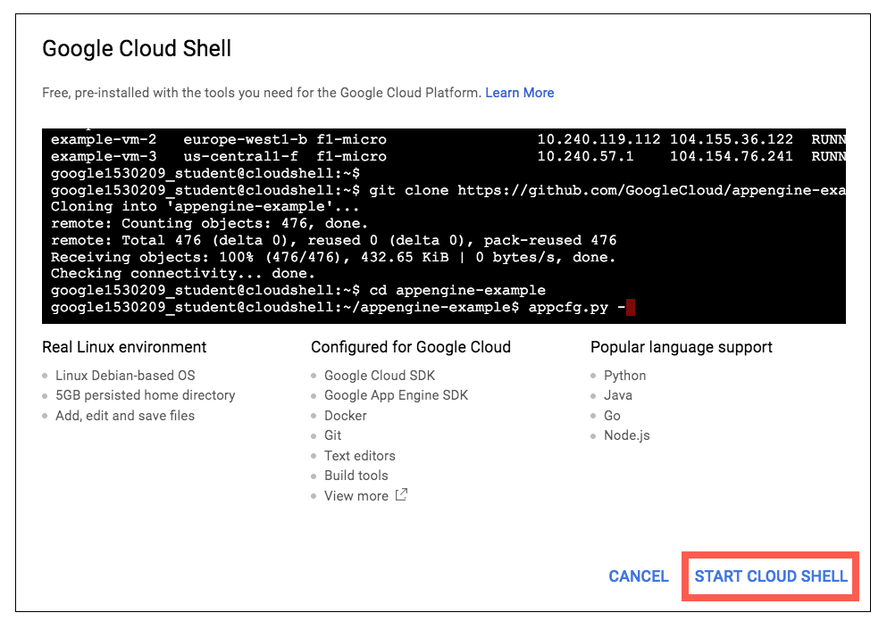
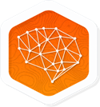

# Cloud Natural Language API: Qwik Start

## GSP097


Google Cloud Natural Language API lets you extract information about people, places, events, (and more) mentioned in text documents, news articles, or blog posts. You can use it to understand sentiment about your product on social media, or parse intent from customer conversations happening in a call center or a messaging app. You can even upload text documents for analysis.

### Cloud Natural Language API features

**Syntax Analysis:** Extract tokens and sentences, identify parts of speech (PoS) and create dependency parse trees for each sentence.

**Entity Recognition:** Identify entities and label by types such as person, organization, location, events, products and media.

**Sentiment Analysis:** Understand the overall sentiment expressed in a block of text.

**Content Classification:** Classify documents in predefined 700+ categories.

**Multi-Language:** Enables you to easily analyze text in multiple languages including English, Spanish, Japanese, Chinese (Simplified and Traditional), French, German, Italian, Korean and Portuguese.

**Integrated REST API:** Access via REST API. Text can be uploaded in the request or integrated with [Google Cloud Storage.](https://cloud.google.com/storage/)

In this lab you'll use the `analyze-entities` method to ask the Cloud Natural Language API to extract "entities" (e.g. people, places, and events) from a snippet of text.

## Setup and Requirements

### **Qwiklabs setup**

#### Before you click the Start Lab button

Read these instructions. Labs are timed and you cannot pause them. The timer, which starts when you click Start Lab, shows how long Cloud resources will be made available to you.

This Qwiklabs hand-on lab lets you do the lab activities yourself in a real cloud environment, not in a simulation or demo environment. It does so by giving you new, temporary credentials that you use to sign in and access the Google Cloud Platform for the duration of the lab.

#### What you need

To complete this lab, you need:

- Access to a standard internet browser (Chrome browser recommended).
- Time to complete the lab.

**Note:** If you already have your own personal GCP account or project, do not use it for this lab.

### **Google Cloud Platform Console**

#### How to start your lab and sign in to the Console

1. Click the **Start Lab** button. If you need to pay for the lab, a pop-up opens for you to select your payment method. On the left, the **Connection Details** panel becomes populated with the temporary credentials that you must use for this lab.

   

2. Copy the username, and then click **Open Google Console**. The lab spins up resources, and then opens another tab that shows the **Choose an account** page.

   **Tip:** Open the tabs in separate windows, side-by-side.

3. On the Choose an account page, click **Use Another Account**.

   

4. The Sign in page opens. Paste the username that you copied from the Connection Details panel. Then copy and paste the password.

   **Important:** You must use the credentials from the Connection Details panel. Do not use your Qwiklabs credentials. If you have your own GCP account, do not use it for this lab (avoids incurring charges).

5. Click through the subsequent pages:

   - Accept the terms and conditions.
   - Do not add recovery options or two-factor authentication (because this is a temporary account).
   - Do not sign up for free trials.

After a few moments, the GCP console opens in this tab.

**Note:** You can view the menu with a list of GCP Products and Services by clicking the **Navigation menu** at the top-left, next to “Google Cloud Platform”. 

### **Cloud Shell**

### Activate Google Cloud Shell

Google Cloud Shell is a virtual machine that is loaded with development tools. It offers a persistent 5GB home directory and runs on the Google Cloud. Google Cloud Shell provides command-line access to your GCP resources.

1. In GCP console, on the top right toolbar, click the Open Cloud Shell button.

   

2. In the dialog box that opens, click **START CLOUD SHELL**:

   

   You can click "START CLOUD SHELL" immediately when the dialog box opens.

It takes a few moments to provision and connect to the environment. When you are connected, you are already authenticated, and the project is set to your *PROJECT_ID*. For example:


**gcloud** is the command-line tool for Google Cloud Platform. It comes pre-installed on Cloud Shell and supports tab-completion.

You can list the active account name with this command:

```
gcloud auth list
```

Output:

```output
Credentialed accounts:
 - <myaccount>@<mydomain>.com (active)
```

Example output:

```Output
Credentialed accounts:
 - google1623327_student@qwiklabs.net
```

You can list the project ID with this command:

```
gcloud config list project
```

Output:

```output
[core]
project = <project_ID>
```

Example output:

```Output
[core]
project = qwiklabs-gcp-44776a13dea667a6
```

Full documentation of **gcloud** is available on [Google Cloud gcloud Overview](https://cloud.google.com/sdk/gcloud).

## Create an API Key

First, you will set an environment variable with your PROJECT_ID which you will use throughout this codelab:

```
export GOOGLE_CLOUD_PROJECT=$(gcloud config get-value core/project)
```

Next, create a new service account to access the Natural Language API:

```
gcloud iam service-accounts create my-natlang-sa \
  --display-name "my natural language service account"
```

Then, create credentials to log in as your new service account. Create these credentials and save it as a JSON file "~/key.json" by using the following command:

```
gcloud iam service-accounts keys create ~/key.json \
  --iam-account my-natlang-sa@${GOOGLE_CLOUD_PROJECT}.iam.gserviceaccount.com
```

Finally, set the GOOGLE_APPLICATION_CREDENTIALS environment variable. The environment variable should be set to the full path of the credentials JSON file you created, which you can see in the output from the previous command:

```
export GOOGLE_APPLICATION_CREDENTIALS="/home/USER/key.json"
```

## Make an Entity Analysis Request

Now you'll try out the Natural Language API's entity analysis with the following sentence:

*Michelangelo Caravaggio, Italian painter, is known for 'The Calling of Saint Matthew'*

Run the following `gcloud` command:

```
gcloud ml language analyze-entities --content="Michelangelo Caravaggio, Italian painter, is known for 'The Calling of Saint Matthew'."
```

You should see a response similar to the following:

```bash
{
  "entities": [
    {
      "name": "Michelangelo Caravaggio",
      "type": "PERSON",
      "metadata": {
        "wikipedia_url": "http://en.wikipedia.org/wiki/Caravaggio",
        "mid": "/m/020bg"
      },
      "salience": 0.83047235,
      "mentions": [
        {
          "text": {
            "content": "Michelangelo Caravaggio",
            "beginOffset": 0
          },
          "type": "PROPER"
        },
        {
          "text": {
            "content": "painter",
            "beginOffset": 33
          },
          "type": "COMMON"
        }
      ]
    },
    {
      "name": "Italian",
      "type": "LOCATION",
      "metadata": {
        "mid": "/m/03rjj",
        "wikipedia_url": "http://en.wikipedia.org/wiki/Italy"
      },
      "salience": 0.13870546,
      "mentions": [
        {
          "text": {
            "content": "Italian",
            "beginOffset": 25
          },
          "type": "PROPER"
        }
      ]
    },
    {
      "name": "The Calling of Saint Matthew",
      "type": "EVENT",
      "metadata": {
        "mid": "/m/085_p7",
        "wikipedia_url": "http://en.wikipedia.org/wiki/The_Calling_of_St_Matthew_(Caravaggio)"
      },
      "salience": 0.030822212,
      "mentions": [
        {
          "text": {
            "content": "The Calling of Saint Matthew",
            "beginOffset": 69
          },
          "type": "PROPER"
        }
      ]
    }
  ],
  "language": "en"
}
```

Read through your results. For each "entity" in the response, you'll see:

- The entity `name` and `type`, a person, location, event, etc.
- `metadata`, an associated Wikipedia URL if there is one
- `salience`, and the indices of where this entity appeared in the text. Salience is a number in the [0,1] range that refers to the centrality of the entity to the text as a whole.
- `mentions`, which is the same entity mentioned in different ways.

You've sent your first request to the Cloud Natural Language API.

## Congratulations!



### Finish Your Quest

Continue your Quest with [Baseline: Data, ML, AI](https://google.qwiklabs.com/quests/34). A Quest is a series of related labs that form a learning path. Completing this Quest earns you the badge above, to recognize your achievement. You can make your badge (or badges) public and link to them in your online resume or social media account. [Enroll in this Quest](https://google.qwiklabs.com/learning_paths/34/enroll) and get immediate completion credit if you've taken this lab. [See other available Qwiklabs Quests](http://google.qwiklabs.com/catalog).

### Next Steps / Learn More

This lab is part of a series of labs called Qwik Starts. These labs are designed to give you a little taste of the many features available with Google Cloud. Search for "Qwik Starts" in the [lab catalog](https://google.qwiklabs.com/catalog) to find the next lab you'd like to take!

### Google Cloud Training & Certification

...helps you make the most of Google Cloud technologies. [Our classes](https://cloud.google.com/training/courses) include technical skills and best practices to help you get up to speed quickly and continue your learning journey. We offer fundamental to advanced level training, with on-demand, live, and virtual options to suit your busy schedule. [Certifications](https://cloud.google.com/certification/) help you validate and prove your skill and expertise in Google Cloud technologies.

##### Manual Last Updated November 26, 2018

##### Lab Last Tested November 26, 2018

Copyright 2018 Google LLC All rights reserved. Google and the Google logo are trademarks of Google LLC. All other company and product names may be trademarks of the respective companies with which they are associated.