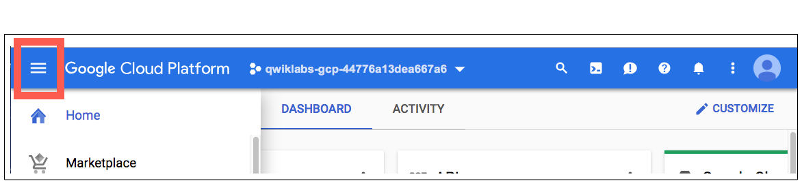

# Entity and Sentiment Analysis with the Natural Language API

## GSP038


## Overview

The Cloud Natural Language API lets you extract entities from text, perform sentiment and syntactic analysis, and classify text into categories.

In this lab, we'll learn how to use the Natural Language API to analyze entities, sentiment, and syntax.

#### **What you'll learn**

- Creating a Natural Language API request and calling the API with curl
- Extracting entities and running sentiment analysis on text with the Natural Language API
- Performing linguistic analysis on text with the Natural Language API
- Creating a Natural Language API request in a different language

#### **What you'll need**

- A Google Cloud Platform Project
- A Browser, such [Chrome](https://www.google.com/chrome/browser/desktop/) or [Firefox](https://www.mozilla.org/firefox/)

## Setup and Requirements

### **Qwiklabs setup**

#### Before you click the Start Lab button

Read these instructions. Labs are timed and you cannot pause them. The timer, which starts when you click Start Lab, shows how long Cloud resources will be made available to you.

This Qwiklabs hand-on lab lets you do the lab activities yourself in a real cloud environment, not in a simulation or demo environment. It does so by giving you new, temporary credentials that you use to sign in and access the Google Cloud Platform for the duration of the lab.

#### What you need

To complete this lab, you need:

- Access to a standard internet browser (Chrome browser recommended).
- Time to complete the lab.

**Note:** If you already have your own personal GCP account or project, do not use it for this lab.

### **Google Cloud Platform Console**

#### How to start your lab and sign in to the Console

1. Click the **Start Lab** button. If you need to pay for the lab, a pop-up opens for you to select your payment method. On the left, the **Connection Details** panel becomes populated with the temporary credentials that you must use for this lab.

   

2. Copy the username, and then click **Open Google Console**. The lab spins up resources, and then opens another tab that shows the **Choose an account** page.

   **Tip:** Open the tabs in separate windows, side-by-side.

3. On the Choose an account page, click **Use Another Account**.

   

4. The Sign in page opens. Paste the username that you copied from the Connection Details panel. Then copy and paste the password.

   **Important:** You must use the credentials from the Connection Details panel. Do not use your Qwiklabs credentials. If you have your own GCP account, do not use it for this lab (avoids incurring charges).

5. Click through the subsequent pages:

   - Accept the terms and conditions.
   - Do not add recovery options or two-factor authentication (because this is a temporary account).
   - Do not sign up for free trials.

After a few moments, the GCP console opens in this tab.

**Note:** You can view the menu with a list of GCP Products and Services by clicking the **Navigation menu** at the top-left, next to “Google Cloud Platform”. 

### **Cloud Shell**

### Activate Google Cloud Shell

Google Cloud Shell is a virtual machine that is loaded with development tools. It offers a persistent 5GB home directory and runs on the Google Cloud. Google Cloud Shell provides command-line access to your GCP resources.

1. In GCP console, on the top right toolbar, click the Open Cloud Shell button.

   

2. In the dialog box that opens, click **START CLOUD SHELL**:

   

   You can click "START CLOUD SHELL" immediately when the dialog box opens.

It takes a few moments to provision and connect to the environment. When you are connected, you are already authenticated, and the project is set to your *PROJECT_ID*. For example:


**gcloud** is the command-line tool for Google Cloud Platform. It comes pre-installed on Cloud Shell and supports tab-completion.

You can list the active account name with this command:

```
gcloud auth list
```

Output:

```output
Credentialed accounts:
 - <myaccount>@<mydomain>.com (active)
```

Example output:

```Output
Credentialed accounts:
 - google1623327_student@qwiklabs.net
```

You can list the project ID with this command:

```
gcloud config list project
```

Output:

```output
[core]
project = <project_ID>
```

Example output:

```Output
[core]
project = qwiklabs-gcp-44776a13dea667a6
```

Full documentation of **gcloud** is available on [Google Cloud gcloud Overview](https://cloud.google.com/sdk/gcloud).

## Create an API Key

Since we'll be using `curl` to send a request to the Natural Language API, we'll need to generate an API key to pass in our request URL. To create an API key, navigate to the API Manager section of your project dashboard:


Click on **Credentials** tab, and then **Create credentials**.


In the drop down menu, select **API key**:


Next, copy the key you just generated and save it to an environment variable to avoid having to insert the value of your API key in each request. You can do this in Cloud Shell. Be sure to replace `<your_api_key>` with the key you just copied.

```
export API_KEY=<YOUR_API_KEY>
```

## Make an Entity Analysis Request

The first Natural Language API method we'll use is `analyzeEntities`. With this method, the API can extract entities (like people, places, and events) from text. To try it out the API's entity analysis, we'll use the following sentence:

*Joanne Rowling, who writes under the pen names J. K. Rowling and Robert Galbraith, is a British novelist and screenwriter who wrote the Harry Potter fantasy series.*

You'll build your request to the Natural Language API in a `request.json` file. You can use your preferred command line editor (`nano`, `vim`, or `emacs`) or the Cloud Shell editor, which you open by clicking the pencil icon:


Create the `request.json` file that contains the following using `gcloud` or your preferred editor:

```
{
  "document":{
    "type":"PLAIN_TEXT",
    "content":"Joanne Rowling, who writes under the pen names J. K. Rowling and Robert Galbraith, is a British novelist and screenwriter who wrote the Harry Potter fantasy series."
  },
  "encodingType":"UTF8"
}
```

**Save** the file.

In the request, you're telling the Natural Language API about the text being sent. Supported type values are `PLAIN_TEXT` or `HTML`. In content, we pass the text to send to the Natural Language API for analysis. The Natural Language API also supports sending files stored in Cloud Storage for text processing. If you wanted to send a file from Cloud Storage, you would replace `content` with `gcsContentUri` and give it a value of the text file's uri in Cloud Storage. `encodingType` tells the API which type of text encoding to use when processing our text. The API will use this to calculate where specific entities appear in our text.

## Call the Natural Language API

You can now pass your request body, along with the API key environment variable you saved earlier, to the Natural Language API with the following `curl` command (all in one single command line):

```
curl "https://language.googleapis.com/v1/documents:analyzeEntities?key=${API_KEY}" \
  -s -X POST -H "Content-Type: application/json" --data-binary @request.json
```

The beginning of your response should look like this:

```bash
{
  "entities": [
     {
      "name": "Robert Galbraith",
      "type": "PERSON",
      "metadata": {
        "mid": "/m/042xh",
        "wikipedia_url": "https://en.wikipedia.org/wiki/J._K._Rowling"
      },
      "salience": 0.7980405,
      "mentions": [
        {
          "text": {
            "content": "Joanne Rowling",
            "beginOffset": 0
          },
          "type": "PROPER"
        },
        {
          "text": {
            "content": "Rowling",
            "beginOffset": 53
          },
          "type": "PROPER"
        },
        {
          "text": {
            "content": "novelist",
            "beginOffset": 96
          },
          "type": "COMMON"
        },
        {
          "text": {
            "content": "Robert Galbraith",
            "beginOffset": 65
          },
          "type": "PROPER"
        }
      ]
    },

    ...
  ]
}
```

For each entity in the response, we get the entity `type`, the associated Wikipedia URL if there is one, the `salience`, and the indices of where this entity appeared in the text. Salience is a number in the [0,1] range that refers to the centrality of the entity to the text as a whole. The Natural Language API can also recognize the same entity mentioned in different ways. Take a look at the `mentions` list in the response: the API is able to tell that "Joanne Rowling", "Rowling", "novelist" and "Robert Galbriath" all point to the same thing.

## Sentiment analysis with the Natural Language API

In addition to extracting entities, the Natural Language API also lets you perform sentiment analysis on a block of text. This JSON request will include the same parameters as the request above, but this time change the text to include something with a stronger sentiment.

Replace the `request.json` file with the following, and feel free to replace the `content` below with your own text:

```
 {
  "document":{
    "type":"PLAIN_TEXT",
    "content":"Harry Potter is the best book. I think everyone should read it."
  },
  "encodingType": "UTF8"
}
```

Next we'll send the request to the API's `analyzeSentiment` endpoint:

```
curl "https://language.googleapis.com/v1/documents:analyzeSentiment?key=${API_KEY}" \
  -s -X POST -H "Content-Type: application/json" --data-binary @request.json
```

Your response should look like this:

```bash
{
  "documentSentiment": {
    "magnitude": 0.8,
    "score": 0.4
  },
  "language": "en",
  "sentences": [
    {
      "text": {
        "content": "Harry Potter is the best book.",
        "beginOffset": 0
      },
      "sentiment": {
        "magnitude": 0.7,
        "score": 0.7
      }
    },
    {
      "text": {
        "content": "I think everyone should read it.",
        "beginOffset": 31
      },
      "sentiment": {
        "magnitude": 0.1,
        "score": 0.1
      }
    }
  ]
}
```

Notice that you get two types of sentiment values: sentiment for the document as a whole, and sentiment broken down by sentence. The sentiment method returns two values:

- `score` - is a number from -1.0 to 1.0 indicating how positive or negative the statement is.
- `magnitude` - is a number ranging from 0 to infinity that represents the weight of sentiment expressed in the statement, regardless of being positive or negative.

Longer blocks of text with heavily weighted statements have higher magnitude values. The score for the first sentence is positive (0.7), whereas the score for the second sentence is neutral (0.1).

## Analyzing entity sentiment

In addition to providing sentiment details on the entire text document, the Natural Language API can also break down sentiment by the entities in the text. Use this sentence as an example:

*I liked the sushi but the service was terrible*.

In this case, getting a sentiment score for the entire sentence as you did above might not be so useful. If this was a restaurant review and there were hundreds of reviews for the same restaurant, you'd want to know exactly which things people liked and didn't like in their reviews. Fortunately, the Natural Language API has a method that lets you get the sentiment for each entity in the text, called `analyzeEntitySentiment`. Let's see how it works!

Update your `request.json` with the sentence above:

```
 {
  "document":{
    "type":"PLAIN_TEXT",
    "content":"I liked the sushi but the service was terrible."
  },
  "encodingType": "UTF8"
}
```

Remember to **Save** the file.

Then call the `analyzeEntitySentiment` endpoint with the following curl command:

```
curl "https://language.googleapis.com/v1/documents:analyzeEntitySentiment?key=${API_KEY}" \
  -s -X POST -H "Content-Type: application/json" --data-binary @request.json
```

In the response you get back two entity objects: one for "sushi" and one for "service." Here's the full JSON response:

```bash
{
  "entities": [
    {
      "name": "sushi",
      "type": "CONSUMER_GOOD",
      "metadata": {},
      "salience": 0.52716845,
      "mentions": [
        {
          "text": {
            "content": "sushi",
            "beginOffset": 12
          },
          "type": "COMMON",
          "sentiment": {
            "magnitude": 0.9,
            "score": 0.9
          }
        }
      ],
      "sentiment": {
        "magnitude": 0.9,
        "score": 0.9
      }
    },
    {
      "name": "service",
      "type": "OTHER",
      "metadata": {},
      "salience": 0.47283158,
      "mentions": [
        {
          "text": {
            "content": "service",
            "beginOffset": 26
          },
          "type": "COMMON",
          "sentiment": {
            "magnitude": 0.9,
            "score": -0.9
          }
        }
      ],
      "sentiment": {
        "magnitude": 0.9,
        "score": -0.9
      }
    }
  ],
  "language": "en"
}
```

You can see that the score returned for "sushi" was 0.9, whereas "service" got a score of -0.9. Cool! You also may notice that there are two sentiment objects returned for each entity. If either of these terms were mentioned more than once, the API would return a different sentiment score and magnitude for each mention, along with an aggregate sentiment for the entity.

## Analyzing syntax and parts of speech

Looking at the Natural Language API's third method - text annotation - you'll dive deeper into the the linguistic details of the text. `annotateText` is an advanced method that provides a full set of details on the semantic and syntactic elements of the text. For each word in the text, the API will tell us the word's part of speech (noun, verb, adjective, etc.) and how it relates to other words in the sentence (Is it the root verb? A modifier?).

Try it out with a simple sentence. This JSON request will be similar to the ones above, with the addition of a features key. This will tell the API that we'd like to perform syntax annotation.

Replace your `request.json` with the following:

```
{
  "document":{
    "type":"PLAIN_TEXT",
    "content": "Joanne Rowling is a British novelist, screenwriter and film producer."
  },
  "encodingType": "UTF8"
}
```

**Save** the file.

Then call the API's `annotateText` method:

```
curl "https://language.googleapis.com/v1/documents:analyzeSyntax?key=${API_KEY}" \
  -s -X POST -H "Content-Type: application/json" --data-binary @request.json
```

The response should return an object like the one below for each token in the sentence:

```bash
{
      "text": {
        "content": "is",
        "beginOffset": 15
      },
      "partOfSpeech": {
        "tag": "VERB",
        "aspect": "ASPECT_UNKNOWN",
        "case": "CASE_UNKNOWN",
        "form": "FORM_UNKNOWN",
        "gender": "GENDER_UNKNOWN",
        "mood": "INDICATIVE",
        "number": "SINGULAR",
        "person": "THIRD",
        "proper": "PROPER_UNKNOWN",
        "reciprocity": "RECIPROCITY_UNKNOWN",
        "tense": "PRESENT",
        "voice": "VOICE_UNKNOWN"
      },
      "dependencyEdge": {
        "headTokenIndex": 2,
        "label": "ROOT"
      },
      "lemma": "be"
    },
```

Let's break down the response:

- `partOfSpeech` tells us that "Joanne" is a noun.
- `dependencyEdge` includes data that you can use to create a [dependency parse tree](https://en.wikipedia.org/wiki/Parse_tree#Dependency-based_parse_trees) of the text. Essentially, this is a diagram showing how words in a sentence relate to each other. A dependency parse tree for the sentence above would look like this:


**Note:** You can create your own dependency parse trees in the browser with the Natural Language demo available here: [https://cloud.google.com/natural-language](https://cloud.google.com/natural-language/)

- `headTokenIndex` is the index of the token that has an arc pointing at "Joanne". We can think of each token in the sentence as a word in an array.
- `headTokenIndex` of 1 for "Joanne" refers to the word "Rowling," which it is connected to in the tree. The label `NN` (short for noun compound modifier) describes the word's role in the sentence. "Joanne" modifies "Rowling," the subject of the sentence.
- `lemma` is the canonical form of the word. For example, the words *run*, *runs*, *ran*, and *running* all have a lemma of *run*. The lemma value is useful for tracking occurrences of a word in a large piece of text over time.

## Multilingual natural language processing

The Natural Language API also supports languages other than English (full list [here](https://cloud.google.com/natural-language/docs/languages)). Modify the `request.json` with a sentence in Japanese:

```
{
  "document":{
    "type":"PLAIN_TEXT",
    "content":"日本のグーグルのオフィスは、東京の六本木ヒルズにあります"
  }
}
```

**Save** the file. Notice that you didn't tell the API which language the text is, it can automatically detect it!

Next, you'll send it to the `analyzeEntities` endpoint:

```
curl "https://language.googleapis.com/v1/documents:analyzeEntities?key=${API_KEY}" \
  -s -X POST -H "Content-Type: application/json" --data-binary @request.json
```

And you get the following response:

```bash
{
  "entities": [
    {
      "name": "日本",
      "type": "LOCATION",
      "metadata": {
        "mid": "/m/03_3d",
        "wikipedia_url": "https://en.wikipedia.org/wiki/Japan"
      },
      "salience": 0.23854347,
      "mentions": [
        {
          "text": {
            "content": "日本",
            "beginOffset": 0
          },
          "type": "PROPER"
        }
      ]
    },
    {
      "name": "グーグル",
      "type": "ORGANIZATION",
      "metadata": {
        "mid": "/m/045c7b",
        "wikipedia_url": "https://en.wikipedia.org/wiki/Google"
      },
      "salience": 0.21155767,
      "mentions": [
        {
          "text": {
            "content": "グーグル",
            "beginOffset": 9
          },
          "type": "PROPER"
        }
      ]
    },
    ...
  ]
  "language": "ja"
}
```

The wikipedia URLs even point to the Japanese Wikipedia pages - so cool!

## Congratulations!

You've learned how to perform text analysis with the Cloud Natural Language API by extracting entities, analyzing sentiment, and doing syntax annotation.

#### **What we've covered**

- Creating a Natural Language API request and calling the API with curl
- Extracting entities and running sentiment analysis on text with the Natural Language API
- Performing linguistic analysis on text to create dependency parse trees
- Creating a Natural Language API request in Japanese


#### Finish your quest

This self-paced lab is part of the Qwiklabs [Machine Learning APIs](https://google.qwiklabs.com/quests/32) Quest. A Quest is a series of related labs that form a learning path. Completing this Quest earns you the badge above, to recognize your achievement. You can make your badge (or badges) public and link to them in your online resume or social media account. [Enroll in this Quest](http://google.qwiklabs.com/learning_paths/32/enroll) and get immediate completion credit if you've taken this lab. [See other available Qwiklabs Quests](http://google.qwiklabs.com/catalog).

#### Take your next lab

Try out another lab on Machine Learning APIs, like [Cloud ML Engine: Qwik Start](https://google.qwiklabs.com/catalog_lab/676) or[Detect Images of Clouds in the Cloud with AutoML Vision](https://google.qwiklabs.com/catalog_lab/1094).

#### Next steps

- Sign up for the full [Coursera Course on Machine Learning](https://www.coursera.org/learn/serverless-machine-learning-gcp/)
- Check out the Natural Language API [tutorials](https://cloud.google.com/natural-language/docs/tutorials) in the documentation.

### Google Cloud Training & Certification

...helps you make the most of Google Cloud technologies. [Our classes](https://cloud.google.com/training/courses) include technical skills and best practices to help you get up to speed quickly and continue your learning journey. We offer fundamental to advanced level training, with on-demand, live, and virtual options to suit your busy schedule. [Certifications](https://cloud.google.com/certification/) help you validate and prove your skill and expertise in Google Cloud technologies.

##### Manual Last Updated August 08, 2018

##### Lab Last Tested May 07, 2018

Copyright 2018 Google LLC All rights reserved. Google and the Google logo are trademarks of Google LLC. All other company and product names may be trademarks of the respective companies with which they are associated.