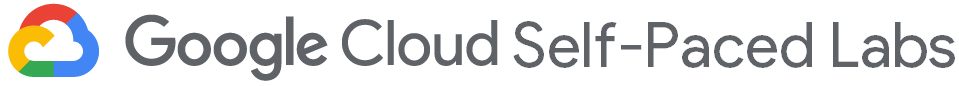
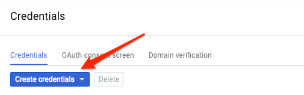

# Speech to Text Transcription with the Cloud Speech API

## GSP048



## Overview

The Cloud Speech API lets you do speech to text transcription from audio files in over 80 languages.

In this lab you'll send an audio file to the Cloud Speech API for transcription.

#### What you'll learn

- Creating a Speech API request and calling the API with curl
- Calling the Speech API with audio files in different languages

#### What you'll need

- A Google Cloud Platform Project
- A Browser, such [Chrome](https://www.google.com/chrome/browser/desktop/) or [Firefox](https://www.mozilla.org/firefox/)

## Setup and Requirements

### **Qwiklabs setup**

#### Before you click the Start Lab button

Read these instructions. Labs are timed and you cannot pause them. The timer, which starts when you click Start Lab, shows how long Cloud resources will be made available to you.

This Qwiklabs hand-on lab lets you do the lab activities yourself in a real cloud environment, not in a simulation or demo environment. It does so by giving you new, temporary credentials that you use to sign in and access the Google Cloud Platform for the duration of the lab.

#### What you need

To complete this lab, you need:

- Access to a standard internet browser (Chrome browser recommended).
- Time to complete the lab.

**Note:** If you already have your own personal GCP account or project, do not use it for this lab.

### **Google Cloud Platform Console**

#### How to start your lab and sign in to the Console

1. Click the **Start Lab** button. If you need to pay for the lab, a pop-up opens for you to select your payment method. On the left, the **Connection Details** panel becomes populated with the temporary credentials that you must use for this lab.

   

2. Copy the username, and then click **Open Google Console**. The lab spins up resources, and then opens another tab that shows the **Choose an account** page.

   **Tip:** Open the tabs in separate windows, side-by-side.

3. On the Choose an account page, click **Use Another Account**.

   

4. The Sign in page opens. Paste the username that you copied from the Connection Details panel. Then copy and paste the password.

   **Important:** You must use the credentials from the Connection Details panel. Do not use your Qwiklabs credentials. If you have your own GCP account, do not use it for this lab (avoids incurring charges).

5. Click through the subsequent pages:

   - Accept the terms and conditions.
   - Do not add recovery options or two-factor authentication (because this is a temporary account).
   - Do not sign up for free trials.

After a few moments, the GCP console opens in this tab.

**Note:** You can view the menu with a list of GCP Products and Services by clicking the **Navigation menu** at the top-left, next to “Google Cloud Platform”. 

### **Cloud Shell**

### Activate Google Cloud Shell

Google Cloud Shell is a virtual machine that is loaded with development tools. It offers a persistent 5GB home directory and runs on the Google Cloud. Google Cloud Shell provides command-line access to your GCP resources.

1. In GCP console, on the top right toolbar, click the Open Cloud Shell button.

   

2. In the dialog box that opens, click **START CLOUD SHELL**:

   

   You can click "START CLOUD SHELL" immediately when the dialog box opens.

It takes a few moments to provision and connect to the environment. When you are connected, you are already authenticated, and the project is set to your *PROJECT_ID*. For example:


**gcloud** is the command-line tool for Google Cloud Platform. It comes pre-installed on Cloud Shell and supports tab-completion.

You can list the active account name with this command:

```
gcloud auth list
```

Output:

```output
Credentialed accounts:
 - <myaccount>@<mydomain>.com (active)
```

Example output:

```Output
Credentialed accounts:
 - google1623327_student@qwiklabs.net
```

You can list the project ID with this command:

```
gcloud config list project
```

Output:

```output
[core]
project = <project_ID>
```

Example output:

```Output
[core]
project = qwiklabs-gcp-44776a13dea667a6
```

Full documentation of **gcloud** is available on [Google Cloud gcloud Overview](https://cloud.google.com/sdk/gcloud).

## Create an API Key

Since you'll be using `curl` to send a request to the Speech API, you'll need to generate an API key to pass in your request URL.

To create an API key, navigate to:

**APIs & services** > **Credentials**:


Then click **Create credentials**:



In the drop down menu, select **API key**:


Next, copy the key you just generated. Click **Close**.

Now save your key to an environment variable to avoid having to insert the value of your API key in each request.

In Cloud Shell run the following, replacing `<your_api_key>` with the key you just copied:

```
export API_KEY=<YOUR_API_KEY>
```

## Create your Speech API request

**Note:** This lab uses a pre-recorded file that's available on Google Cloud Storage: `gs://cloud-samples-tests/speech/brooklyn.flac`. You can listen to this file before sending it to the Speech API [here](https://storage.cloud.google.com/speech-demo/brooklyn.wav).

Build your request to the Speech API in a `request.json` file in Cloud Shell:

```
touch request.json
```

Open the file using your preferred command line editor (`nano`, `vim`, `emacs`) or `gcloud`. Add the following to your `request.json` file, using the `uri` value of the sample raw audio file:

```
{
  "config": {
      "encoding":"FLAC",
      "languageCode": "en-US"
  },
  "audio": {
      "uri":"gs://cloud-samples-tests/speech/brooklyn.flac"
  }
}
```

The request body has a `config` and `audio` object.

In `config`, you tell the Speech API how to process the request:

- The `encoding` parameter tells the API which type of audio encoding you're using while the file is being sent to the API. `FLAC` is the encoding type for .raw files (here is [documentation](https://cloud.google.com/speech/reference/rest/v1/RecognitionConfig) for encoding types for more details).
- `languageCode` will default to English if left out of the request.

There are other parameters you can add to your `config` object, but `encoding` is the only required one.

In the `audio` object, you pass the API the uri of the audio file which is stored in Cloud Storage for this lab.

Now you're ready to call the Speech API!

## Call the Speech API

Pass your request body, along with the API key environment variable, to the Speech API with the following `curl` command (all in one single command line):

```
curl -s -X POST -H "Content-Type: application/json" --data-binary @request.json \
"https://speech.googleapis.com/v1/speech:recognize?key=${API_KEY}"
```

Your response should look something like this:

```bash
{
  "results": [
    {
      "alternatives": [
        {
          "transcript": "how old is the Brooklyn Bridge",
          "confidence": 0.98267895
        }
      ]
    }
  ]
}
```

The `transcript` value will return the Speech API's text transcription of your audio file, and the `confidence` value indicates how sure the API is that it has accurately transcribed your audio.

Notice that you called the `syncrecognize` method in our request above. The Speech API supports both synchronous and asynchronous speech to text transcription. In this example a complete audio file was used, but you can also use the `syncrecognize` method to perform streaming speech to text transcription while the user is still speaking.

## Speech to text transcription in different languages

Are you multilingual? The Speech API supports speech to text transcription in over 100 languages! You can change the `language_code` parameter in `request.json`. You can find a list of supported languages [here](https://cloud.google.com/speech/docs/languages).

Let’s try a French audio file (listen to it [here](https://storage.googleapis.com/speech-language-samples/fr-sample.flac) if you’d like a preview).

Edit your `request.json` and change the content to the following:

```
 {
  "config": {
      "encoding":"FLAC",
      "languageCode": "fr"
  },
  "audio": {
      "uri":"gs://speech-language-samples/fr-sample.flac"
  }
}
```

Now call the Speech API by running the `curl` command again.

You should see the following response:

```
{
  "results": [
    {
      "alternatives": [
        {
          "transcript": "maître corbeau sur un arbre perché tenait en son bec un fromage",
          "confidence": 0.9710122
        }
      ]
    }
  ]
}
```

This is a sentence from a popular French [children’s tale](https://fr.wikipedia.org/wiki/Le_Corbeau_et_le_Renard). If you’ve got audio files in another language, you can try adding them to Cloud Storage and changing the `languageCode` parameter in your request.

## Congratulations!

You've learned how to perform speech to text transcription with the Speech API. In this lab you passed the API the Google Cloud Storage URI of your audio file. Alternatively, you can pass a base64 encoded string of your audio content.

#### **What was covered**

- Passing the Speech API a Google Cloud Storage URI of an audio file
- Creating a Speech API request and calling the API with curl
- Calling the Speech API with audio files in different languages

#### Next Steps

- Check out the Speech API [tutorials](https://cloud.google.com/speech/docs/tutorials) in the documentations.
- Try out the [Vision API](https://cloud.google.com/vision/) and [Natural Language API](https://cloud.google.com/natural-language/)!

### Google Cloud Training & Certification

...helps you make the most of Google Cloud technologies. [Our classes](https://cloud.google.com/training/courses) include technical skills and best practices to help you get up to speed quickly and continue your learning journey. We offer fundamental to advanced level training, with on-demand, live, and virtual options to suit your busy schedule. [Certifications](https://cloud.google.com/certification/) help you validate and prove your skill and expertise in Google Cloud technologies.

##### Manual Last Updated October 24, 2018

##### Lab Last Tested October 24, 2018

Copyright 2018 Google LLC All rights reserved. Google and the Google logo are trademarks of Google LLC. All other company and product names may be trademarks of the respective companies with which they are associated.